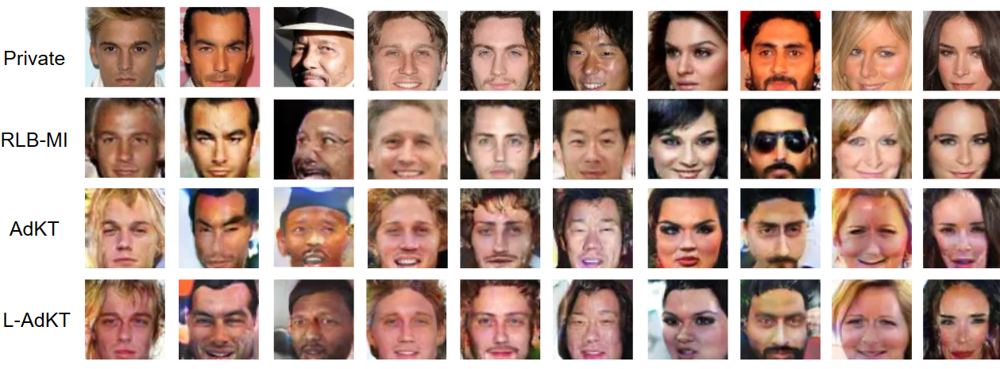

# Adversarial Knowledge Transfer for Black-Box Model Inversion Attack

This repository contains the code associated with the paper titled **"Adversarial Knowledge Transfer for Black-Box Model Inversion Attack"**, which has been accepted for publication at **ICASSP 2025**.

## Paper Overview

In this work, we propose a novel approach for **black-box model inversion attacks (MIA)** using **Adversarial Knowledge Transfer (AdKT)**.

## Code Availability

The code for this paper will be made available soon. Please stay tuned!

**Coming Soon...**
